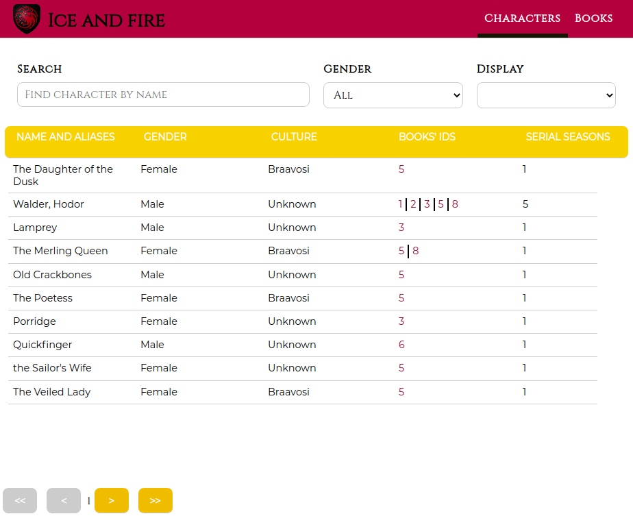

# Project description

Encyclopedia dedicated to the books of Ice and Fire by George R. R. Martin.

## Functions

1. Fetches data from an external Ice and Fire API.
2. Prop Types typings for React Components
3. Implemented Redux app state management
4. Table with characters from the books (Name and Aliases, Gender, Culture, Book list(ID only), number of seasons in which it occurs)
5. Table with the books (Name, ISBN, Number of pages, Release date)
6. Find character by name
7. Filtr characters by the Gender
8. Pagination - First page, Previous page, Next page, Last page
9. Display 5, 10, 15, 20, 25 results

## Perview of the application

## How to start the app with docker

The image is prepared to production build and it is run on ngnix server.

To run the image: docker run -itp 8000:8000 karosowa/ice-and-fire-front:1.0.0

The app is running at [http://localhost:8000](http://localhost:8000).

You need to have installed docker on your computer.

## How to start with npm

After downloading repository, in the project directory, you can run:

### `npm install`

and then

### `npm start`

Runs the app in the development mode.\
Open [http://localhost:3000](http://localhost:3000) to view it in the browser.

### `npm run build`

Builds the app for production to the `build` folder.\
